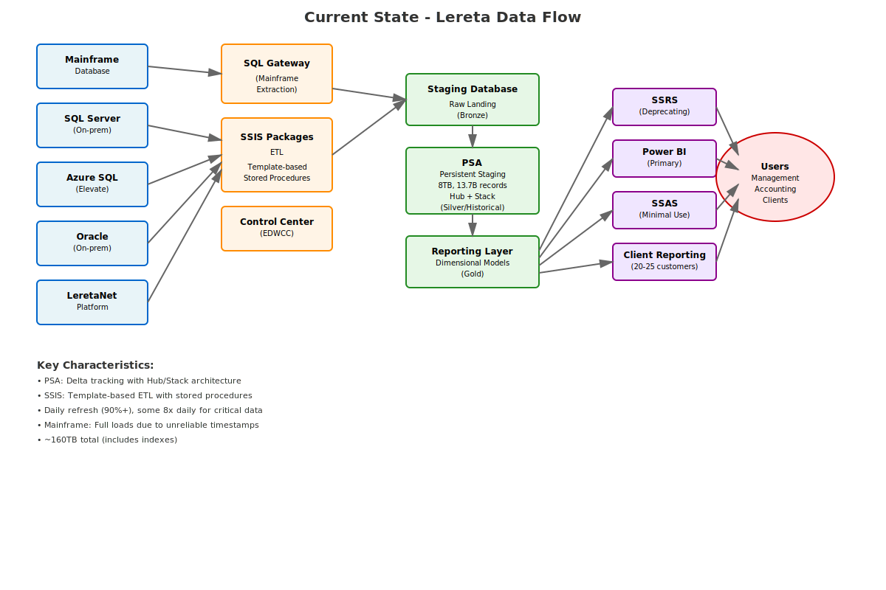
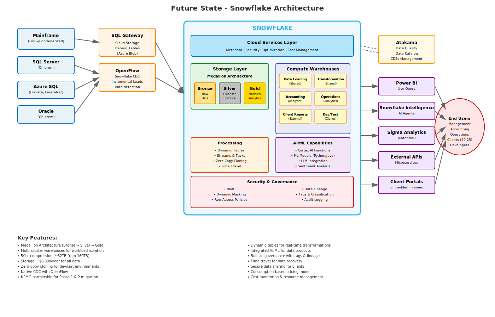

  

# Lereta Data Architecture - Complete Product List

Based on meeting notes from November 5, 2025

---

## Architecture Diagrams

### Current State Data Flow

  

### Future State Architecture with Snowflake

  

### Network Diagram - System Interconnections

  

---

## SOURCE SYSTEMS

### Current Production Systems

- **Mainframe (Database)** - Currently on-premises, migrating to Linux/containerized environment
- **SQL Server** - On-premises deployment
- **Azure SQL** - Cloud-based SQL Server
  - **Elevate** - New front-end application replacing mainframe
  - **LeretaNet Platform** - Core operational platform
- **Oracle Database** - On-premises, limited use (<10-15 sources)
- **Text Files** - Flat file sources for limited integrations

---

## INTEGRATION & ETL TOOLS

### Current State

- **SSIS (SQL Server Integration Services)** - Template-based ETL packages
  - Stored procedure-based transformations
  - Over 500+ packages in use
- **SQL Gateway (Software AG)** - Mainframe data extraction
  - Generates flat files from mainframe queries
  - Primary interface for mainframe data
- **Control Center (EDWCC)** - Metadata management database
  - Stores extraction metadata
  - Table-driven configuration

### Future State

- **OpenFlow (Snowflake)** - Native Snowflake CDC and data integration
  - Incremental load management
  - Auto-detection of schema changes
  - Managed CDC without source system requirements
- **Azure Blob Storage / ADLS (Azure Data Lake Storage)** - Cloud storage layer
  - Staging for mainframe extracts
  - Potential Iceberg table format for external tables
- **Iceberg Tables** - Open table format for external data access

---

## DATA WAREHOUSE / PLATFORM

### Current State

**SQL Server Enterprise Data Warehouse (EDW)**

- **Staging Database** - Raw landing zone (Bronze layer equivalent)
- **PSA (Persistent Staging Area)** - Historical delta storage (Silver layer equivalent)
  - 8TB of data storage
  - 13.7 billion records
  - Hub + Stack architecture for delta tracking
  - ~160TB total (including indexes)
- **Reporting Layer** - Dimensional models (Gold layer equivalent)
  - Star schema design
  - Pre-aggregated for performance

### Future State

**Snowflake (Business Critical Edition)**

- **Cloud Services Layer**
  - Metadata management
  - Security and access control
  - Query optimization
  - Cost management and monitoring
  
- **Storage Layer** - Medallion Architecture
  - **Bronze** - Raw data ingestion
  - **Silver** - Cleansed and historized data
  - **Gold** - Modeled analytics-ready data
  - Expected ~32TB after 5:1+ compression
  
- **Compute Warehouses** (Multiple clusters planned)
  - Data Loading (Shared services)
  - Transformation (Shared services)
  - Accounting Analytics
  - Operations Analytics
  - Client Reports (External)
  - Dev/Test (Zero-copy clones)

---

## DATA GOVERNANCE & QUALITY

- **Atakama (Atacama)** - Enterprise data governance platform
  - Data quality monitoring
  - Data catalog and glossary
  - Critical Data Elements (CDEs) management
  - Data lineage tracking (extends Snowflake's native lineage)
  - Integration with Snowflake planned for Phase 1/2

- **Snowflake Horizon** - Native Snowflake governance
  - Data catalog
  - Data lineage
  - Access history
  - Tag-based classification

---

## ANALYTICS & REPORTING

### Current State

- **SSRS (SQL Server Reporting Services)** - Being deprecated
  - Only 3 reports used by EDW team
  - One product supporting 18-20 outsourcing clients
  - Target: Migration to Power BI
  
- **SSAS (SQL Server Analysis Services)** - Minimal use
  - Small capacity usage for specific reports
  - Wrapping down most use cases
  - Being replaced with aggregated tables
  
- **Power BI** - Primary reporting platform
  - Main analytics tool for data services team
  - ~500+ reports across organization
  - Live query capability
  
- **Excel** - Limited, non-production use
  - Internal analysis only
  - No productionalized solutions
  - Export capability for end users

### Future State / Additional Tools

- **Power BI** - Enhanced with Snowflake
  - Live query to Snowflake
  - Improved performance
  - Embedded iFrames for client portals
  
- **Snowflake Intelligence (Cortex AI)** - AI-powered analytics
  - Natural language query agents
  - Domain-aware AI assistants
  - Self-service analytics
  
- **Sigma Analytics** (Under consideration)
  - Excel-like interface
  - No local data storage
  - Direct query to Snowflake
  - Parallel query execution
  - Faster than Power BI for ad-hoc analysis

---

## AI/ML CAPABILITIES

### Snowflake Native

- **Snowflake Cortex AI** - Integrated AI platform
  - LLM integration (Claude, GPT models hosted in Snowflake)
  - Sentiment analysis
  - Text summarization
  - Translation services
  
- **AI Functions**
  - `AI_TRANSCRIBE` - Audio transcription (Whisper-based)
  - Sentiment scoring
  - Entity recognition
  
- **ML Model Support**
  - Python UDFs for custom models
  - Java UDFs for custom models
  - Model deployment and serving
  - Direct model calls from SQL and AI agents

### External / Custom

- **Lereta GPT (Neo)** - Internal AI assistant
  - Collection of domain-aware models
  - Built with Claude models via GitHub
  - Hosted internally (not using public APIs)
  - Focus on domain-specific knowledge

---

## DEVELOPMENT & COLLABORATION

- **GitHub** - Source code repository
  - Hosting Claude AI models
  - Version control
  - Code collaboration
  
- **Zendesk** - Customer service platform
  - Potential integration for transcription
  - Sentiment analysis on support tickets
  - Call center analytics

---

## CLOUD INFRASTRUCTURE

### Microsoft Azure

- **Azure SQL** - Managed SQL Server
  - Elevate application backend
  - LeretaNet platform
  
- **Azure Blob Storage** - Object storage
  - Staging area for data integration
  - Potential mainframe extract storage
  
- **Azure Data Lake Storage (ADLS)** - Data lake
  - Tiered storage (hot/cool/archive)
  - External table source for Snowflake

**Note:** Azure Data Factory (ADF) will NOT be used in future state architecture

---

## MIGRATION & IMPLEMENTATION PARTNERS

### Selected Partner

- **KPMG** - Primary migration partner
  - **Phase 1** (6 weeks, starting early December 2025)
    - Current state assessment
    - Future state architecture design
    - Data migration roadmap
    - Code migration strategy
    - 2 POC use cases identified
  - **Phase 2** (4-6 months, starting mid/late January 2026)
    - Data migration execution
    - Code refactoring
    - Bronze/Silver layer implementation
    - Integration with Atacama governance
  - Snowflake architect included in team
  - Atacama integration specialist

### Snowflake Support

- **Snowflake Professional Services**
  - RSA (Resident Solution Architect) - Platform design and best practices
  - Migration Specialist - Accelerated migration patterns
  - Training and enablement
  
- **Seven Rivers** (Evaluated, not selected)

### Other Vendors Considered

- **West Monroe** - Evaluated, not selected
- **Other board-recommended vendors** - Evaluated

---

## PROCESS AUTOMATION & ORCHESTRATION

### Current

- **SSIS Packages** - ETL orchestration
- **SQL Server Agent** - Job scheduling
- **Stored Procedures** - Data transformations

### Future

- **Snowflake Streams** - Change data capture
- **Snowflake Tasks** - Job scheduling and orchestration
- **Dynamic Tables** - Auto-updating materialized views
- **Zero-Copy Cloning** - Dev/test environment management

---

## TRAINING & CERTIFICATION

- **Snowflake Fundamentals** - 4-day class
  - Target: ~15 data analysts and engineers
  - On-site delivery option
  - Prepares for Snowflake certifications
  
- **Snowflake Certifications** - Professional certifications
  - Costs included in training packages

---

## KEY METRICS & SCALE

### Current State

- **Data Volume:** ~160TB total (including indexes)
- **PSA Data Only:** ~8TB
- **Record Count:** 13.73 billion records in PSA
- **Report Count:** 500+ reports across organization
  - Only 3 SSRS reports for EDW team
- **Integration Sources:** Primarily SQL Server and mainframe
  - 10-15 Oracle sources
- **Refresh Cadence:** 
  - 90%+ daily refresh
  - Some critical data: 8x per day
  - Mainframe: Full loads (unreliable timestamps)

### Future State Projections

- **Snowflake Storage:** ~32TB (after 5:1+ compression)
- **Storage Cost:** ~$8,800/year for all data
- **Maximum Scenario:** ~$44,000/year (no compression)
- **Client Reporting:** 20-25 external customers
- **Total Customers:** ~3,000
- **Team Size:** Currently 2 data engineers + 1 lead
  - Target: Small, efficient team ("feel like an army")

---

## STRATEGIC INITIATIVES

### Data Quality Focus

- **Critical Data Elements (CDEs)** - Focus on highest-value data
  - Three primary domains: Agency, Customer, Loan
  - Governance and quality rules applied first to CDEs
  - Build catalog and glossary around CDEs

### Modernization Goals

- Replace mainframe with containerized Linux environment
- Eliminate SSRS dependency
- Reduce complexity across systems
- Enable self-service analytics
- Create data products for revenue generation
- Implement machine learning for business value

### Business Objectives

- **Compete with CoreLogic** - Market leader in data products
- **Generate new revenue streams** - Data monetization
- **Improve SLA reporting** - Client transparency
- **Enable data science** - ML/AI capabilities
- **Simplify architecture** - Reduce technical debt

---

## IMPLEMENTATION TIMELINE

- **Phase 0 (Current):** Contracts and MSA finalization
- **Phase 1:** December 2025 - January 2026 (6 weeks)
  - Assessment and design
  - POC identification
- **Phase 2:** January 2026 - June/July 2026 (4-6 months)
  - Migration execution
  - Snowflake implementation
  - Atacama integration
- **Phase 3:** TBD
  - Out-of-scope items
  - Additional enhancements
  - Ongoing optimization

---

## NOTES & CONSIDERATIONS

### Migration Strategy

- Prioritize native Snowflake features
- Avoid Spark-based transformations (cost and complexity)
- Use OpenFlow for CDC where possible
- Mainframe data via cloud storage and Iceberg tables
- Zero-copy cloning for dev/test environments
- Focus on CDE migration first

### Cost Management

- Tag-based resource tracking
- Warehouse sizing and optimization
- Separate compute for different workloads
- Consumption monitoring dashboards
- Multi-year contract for best pricing

### Security & Compliance

- Role-Based Access Control (RBAC)
- Dynamic data masking
- Row-level security policies
- Audit logging for all activities
- Data classification via tags
- Integration with Atacama governance

---

*Document created from meeting transcript dated November 5, 2025*  
*Last updated: November 13, 2025*

